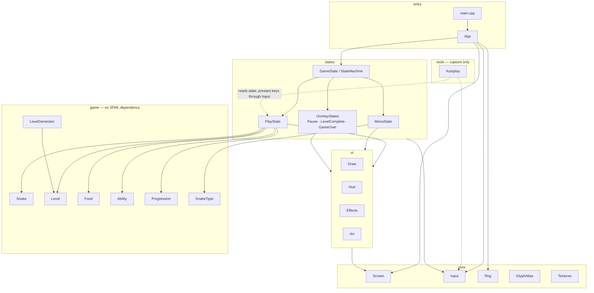
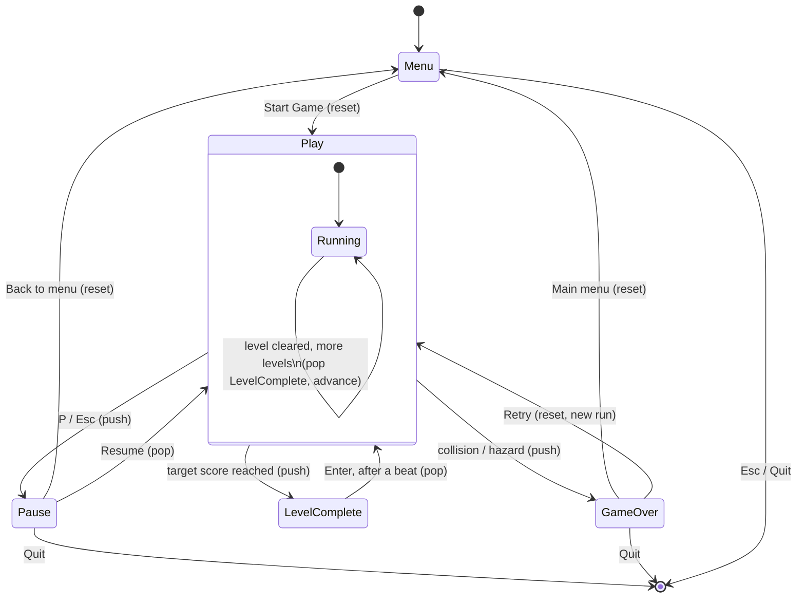
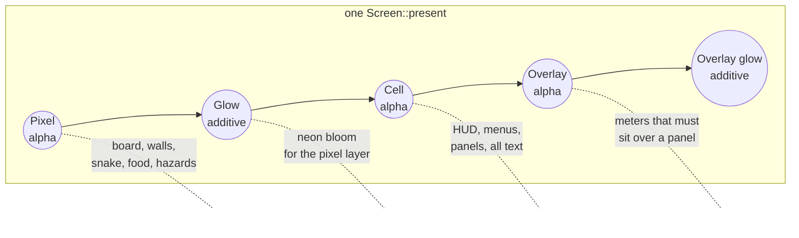

# NEON COIL

An arcade snake game in C++20 on SFML: five playable snakes with distinct abilities,
procedurally generated levels that are *provably* playable, level-by-level score
progression, and a proper front end.


<sup>Every screenshot and clip on this page is the real build. None of it was staged:
the game renders and records itself, offscreen, from a pinned seed — see
[Capturing media](#capturing-media).</sup>

---

## Highlights

- **Five snake types**, each with a real mechanical identity and an active ability —
  not a palette swap.
- **Procedural levels** built from seven layout archetypes, mirrored for readability,
  and validated so unreachable pockets and spawn traps cannot occur.
- **Deterministic seeds.** A run seed is shown on the HUD and can be pinned from the
  command line, so any level you hit can be regenerated exactly.
- **Level progression** with per-level score targets, clear bonuses, and difficulty
  that comes from layout and hazards rather than raw speed.
- **Fully procedural visuals** — additive neon glow, particles, floating score text and
  screen shake, drawn from an atlas the game rasterises at start-up rather than from a
  sprite sheet or a font file. See "Art, and what stays procedural" below.

## Screens

**The front end.** A name, one of eight colours, and the roster. Each snake's speed,
growth and ability sit next to its portrait, so the pick is informed rather than blind.


**A run.** Level 8 on a `Pillars` layout, 405 of the 520 points needed to clear it, on a
×3 combo. Four sentinels are on patrol, a bonus fruit is burning down its timer in the
bottom-right corner, and Dash is a third of the way back off cooldown. The HUD carries
the target, the ability state and the seed the board was generated from.


**Pause and level clear.** Both are overlays rather than screens. The world below them
is suspended, not torn down: the board keeps rendering, the HUD keeps its score and
combo, and the level-clear panel still has the snake and the flash from the last fruit
around its edges.


**Game over.** The same run ended on level 16 with 15,396 points, caught by a sentinel.
The seed is on the panel, so that exact run replays with `--seed 424242`.


## Build

> **Open the folder, not a solution.** This project is CMake-only. There is no `.sln`
> or `.vcxproj`; if Visual Studio ever recreates one from its cache, delete it along
> with the `.vs` folder and reopen the folder.

Requires Visual Studio 2022 or later with the C++ desktop workload. CMake and Ninja
ship with it. SFML 3.1.0 is fetched and built automatically on first configure, so the
first build takes a few minutes and every one after that is incremental.

**Visual Studio:** `File → Open → Folder…` → the repo root → pick the `debug` or
`release` configuration from the toolbar → F5.

**Command line** (PowerShell — note `;`, not `&&`, on Windows PowerShell 5.1):

```powershell
cmake --preset release ; cmake --build build-release
```

## Play

```powershell
.\build\bin\NeonCoil.exe
```

Enter a name, pick a colour and a snake, and start. No arguments are required.

### Controls

| Key | Action |
|---|---|
| `W` `A` `S` `D` or arrow keys | Move |
| `Space` | Fire your ability |
| `P` or `Esc` | Pause |
| `Enter` | Confirm |
| `R` | Retry from the game-over screen |

Two turns can be buffered, so fast double-taps around a corner register instead of
being swallowed.

### Command line

| Flag | Effect |
|---|---|
| `--seed <n>` | Pin the run seed so every level is reproducible |
| `--name <text>` | Pre-fill the player name |
| `--snake <1-5>` | Pre-select a snake type |
| `--selftest <n>` | Generate and validate `n` levels, print a report, exit |
| `--dump <n>` | Print level `n` as ASCII and exit |
| `--uidump <screen>` | Render `menu`/`play`/`pause`/`clear`/`over` offscreen as ASCII |
| `--screenshot <screen> <file.png>` | Render a screen offscreen and write it to a PNG |
| `--capture <screen> <dir>` | Write a numbered PNG sequence, for assembling into an animation |
| `--frames <n>` | Frames to simulate before a dump or screenshot (default 200) |
| `--every <n>` | Save one frame in `n` while capturing (default 2) |
| `--skip <n>` | Simulate `n` frames before the first one is saved |
| `--demo` | Let the autopilot play while capturing |
| `--help` | Usage |

These development tools ship in the build on purpose: they are how the level generator
and the screens are verified, with no GPU window and no human in the loop. `--frames`
drives them far enough to reach a real game state.

### Capturing media

Everything on this page came out of the build itself. An unattended `PlayState` only
slides into the nearest wall, so `--demo` puts an autopilot on the controls — a
breadth-first search to the closest food, refusing any turn into a pocket it could not
get back out of. It presses the same arrow and space keys a player would, through the
same `Input`, so a capture exercises the shipped input path rather than a side door.

The screenshots on this page:

```powershell
.\build\bin\NeonCoil.exe --seed 424242 --name AHMED --screenshot menu  docs\shot_menu.png  --frames 260
.\build\bin\NeonCoil.exe --seed 424242 --name AHMED --demo --screenshot play  docs\shot_clear.png --frames 7600
.\build\bin\NeonCoil.exe --seed 424242 --name AHMED --demo --screenshot play  docs\shot_play.png  --frames 8100
.\build\bin\NeonCoil.exe --seed 424242 --name AHMED --demo --screenshot pause docs\shot_pause.png --frames 9000
.\build\bin\NeonCoil.exe --seed 424242 --name AHMED --demo --screenshot play  docs\shot_over.png  --frames 20000
```

Three of those name the `play` screen and are not mock-ups of a level-clear or a
game-over panel. They are one run at 7,600, 8,100 and 20,000 frames — where the
autopilot happened to be clearing level 7, working level 8, and being caught by a
sentinel on level 16. The pause shot is the same run too: `--demo` reaches that screen
by playing and then pressing `P`, because a `PlayState` paused at frame zero freezes on
the level-one intro and never shows a board worth looking at.

The clips are a PNG sequence assembled by a small Pillow script. `--skip` starts the
capture deep into a run so it opens on a real board rather than on level 1:

```powershell
.\build\bin\NeonCoil.exe --seed 424242 --name AHMED --demo --capture play out\frames --frames 8180 --skip 7700 --every 4
python tools\make_gif.py out\frames docs\demo_play.gif --width 720 --fps 15
```

Because every capture runs from a pinned seed at a fixed 1/60s timestep with no window
and no wall clock in the loop, re-running these commands reproduces the same images.

## The roster

| Snake | Speed | Growth | Ability | Plays like |
|---|---|---|---|---|
| **Viper** | ×1.25 | +1 | **Dash** — 2s of double speed (CD 8s) | Aggressive routing with no safety net |
| **Bulwark** | ×0.85 | +1 | **Iron Scales** — absorbs the next lethal hit and shatters the wall (CD 15s) | Forgiving; turns mistakes into open space |
| **Wraith** | ×1.00 | +1 | **Phase** — 2.5s through walls and your own body (CD 12s) | Shortcuts through mazes |
| **Midas** | ×1.00 | **+2** | **Gold Rush** — 5s of ×3 food, each bite drops a bonus fruit (CD 18s) | Ends levels fast before length becomes a problem |
| **Ouroboros** | ×1.10 | +1 | **Shed** — drop half your tail, banking 5 points a segment (CD 10s) | Grow big, then cash out |

Midas finishing level 7 on 1,055 points against a 460 target, then starting level 8.
Two segments a bite and triple food value under Gold Rush means the level ends on
scoring rate long before length becomes the problem:


Balance notes worth knowing:

- **Nothing** passes through the arena border — not Phase, not Iron Scales.
- If Phase expires while your head is inside a wall, you die. That is what stops it
  from being a free pass through every level.
- Sentinels are lethal even while phasing. Iron Scales does stop them.
- Shed is refused (rather than wasted) on a snake shorter than seven segments.

## Level generation

Every level is generated from `hash(runSeed, levelIndex)`, so it is fully reproducible.

1. An **archetype** is drawn from a depth-gated pool: `Open Field` and `Pillars` from
   level 1, `Chambers` and `Rings` from 3, `Shards` from 5, `Corridors` and `Cavern`
   from 7.
2. Obstacle density scales from 2% to 16%; sentinels appear from level 5 (up to four);
   tick speed rises by at most 35% across the whole run.
3. The layout is **mirrored horizontally**, which is what makes it read as designed
   rather than as noise.
4. A **spawn pocket** is carved clear.
5. **Dead-end removal** knocks open any tile with only one exit — in a game where you
   cannot stop moving, a one-tile dead end is an instant-death trap.
6. A flood fill from spawn walls off **every region it cannot reach**. Unreachable open
   tiles therefore do not exist, so food can never spawn somewhere you cannot go.
7. If the surviving area is under 45% of the interior, the level is regenerated at a
   lower density. Six attempts, then a guaranteed-valid open room — generation cannot
   fail.

Food spawning is the one operation that can genuinely run out of room. It reports
failure instead of looping, and a board with no free tile counts as a completed level.

### Verifying it

```powershell
.\build\bin\NeonCoil.exe --selftest 20000
```

This sweeps 40 level indices and both start lengths, asserting on every run that the
border is sealed, the spawn and the body tiles behind it are clear, there is room to
move on spawn, no sentinel starts in the spawn pocket, the open-tile cache is current,
every open tile is reachable, and the playable area clears the minimum. The current
build passes 20,000 iterations with zero failures.

## Progression

| | Formula |
|---|---|
| Level target | `100 + 60 × (n − 1)` |
| Food value | `10 + 5 × (n − 1)` |
| Clear bonus | `50 × n + overshoot / 2` |
| Tick | `0.15s ÷ min(1.35, 1 + 0.03 × (n − 1))` |

Food value is tied to the target on purpose: it holds every level at roughly ten to
twelve pickups indefinitely, instead of quietly becoming a grind by level 20. Bonus
fruit (×3) and the combo multiplier (up to ×5 for eating in quick succession) reward
efficiency on top of that.

The snake resets to its starting length at each new level, so difficulty comes from the
board rather than from an unmanageable tail.

## Architecture

Four layers, each only knowing about the one below it: `core` (window, input, RNG,
text/shape rasterising), `game` (rules — snake, level, food, abilities, progression,
none of it aware SFML exists), `states` (the screens, wiring `game` to input and to
`ui`), `ui` (drawing helpers built on `core::Screen`). `App` and `main.cpp` sit above
all four and only exist to parse argv and drive the loop or a capture.



`game` never includes an SFML header — `Snake`, `Level`, `Food`, `Ability` and
`Progression` are plain data and logic, which is what makes `--selftest` able to
generate and validate 20,000 levels with no window, no renderer, and no frame loop.

### The state stack

Screens are a stack, not a single "current screen" variable. `Pause`, `LevelComplete`
and `GameOver` are **overlays**: pushed on top of `PlayState` rather than replacing it,
so the board underneath keeps its snake, its score and its combo — which is why the
pause and level-clear screenshots above still show a live board behind the panel.
`StateMachine::update` only calls `update` on the top of the stack (an overlay
genuinely suspends the world), but `render` walks back to the last non-overlay state
and draws forward, compositing every overlay above it on top.



Three design decisions worth calling out beyond the stack itself:

- **Snake types are a data table, not a class hierarchy.** Adding a snake is one row in
  `SnakeType.cpp` plus, if it brings a new ability, one case in `Ability.cpp`.
- **Ability effects live in one file.** Gameplay code never branches on `AbilityKind`;
  it asks `speedScale()`, `canPhaseWalls()`, `scoreMultiplier()` and so on.
- **Levels are generated, then proven, before they're handed to `PlayState`.** See
  "Level generation" above — the generator's invariants are checked by construction,
  not hoped for at runtime.

```
src/
  main.cpp          entry point and mode dispatch
  App.*             CLI parsing, self-test, UI dump, the frame loop
  core/
    Screen.*        window, virtual canvas, letterboxing, the batched draw layers
    GlyphAtlas.*    rasterises text and shape glyphs into one texture at start-up
    BlockFont.*     the 5x5 bitmap font, shared by the atlas and the big captions
    Input.*         edge-triggered actions fed from the window's event queue
    Rng.*           seeded mt19937 with a mixer for reproducible sub-seeds
    Vec2.h  Colors.h  Glyphs.h
  game/
    Snake.*         body, movement, buffered turns, occupancy counts
    SnakeType.*     the roster, as data
    Ability.*       every ability effect, behind queries the game asks
    Level.*         tile grid, hazards, open-tile cache
    LevelGenerator.*  archetypes, validation, seeding
    Food.*          normal and timed bonus food
    Progression.*   targets, food values, difficulty curve
    Direction.h
  states/
    GameState.*     state interface and the state stack
    MenuState.*     name, colour, snake selection with a live preview
    PlayState.*     the run: board, snake, food, scoring, level progression
    OverlayStates.* pause, level complete, game over
  tools/
    Autoplay.*      the --demo autopilot: BFS to the nearest food, refusing any
                    turn into a pocket it cannot escape. Capture tooling only --
                    no gameplay code consults it.
  ui/
    Draw.*  board and meter helpers   Art.*  big block-font captions
    Hud.*   the play HUD              Effects.*  particles, shake, flash
    Layout.h  canvas, cell grid and board pixel constants
```

This tree is the same four layers as the dependency diagram above, just laid out as
paths instead of arrows.

### Rendering

`Screen` owns the window and draws to a fixed **1920×960 virtual canvas** that is
letterboxed into whatever size the window is, so the layout is identical at any
resolution and in fullscreen (`F11`). Everything is batched into a handful of draw
calls across five layers, in order:

| Layer | Blend | Holds |
|---|---|---|
| Pixel | alpha | Board, walls, snake, food, hazards, particles |
| Glow | additive | Neon bloom for all of the above |
| Cell | alpha | HUD, menus, panels, all text |
| Overlay | alpha | Pixel-precise widgets that must sit over a panel — the meters |
| Overlay glow | additive | Their bloom |



Each layer is one `sf::VertexArray`, filled by every state's `render()` call across the
frame and flushed as a single draw call in `Screen::present` — so five layers means five
draw calls for everything on the atlas: walls, snake, particles, HUD text, panels, all
of it, however many there are. Loaded images (the logo, portraits, board sprites) sit
outside the atlas and each cost their own draw call, inserted before, between or after
the five depending on their `SpriteLayer` (`Background` / `World` / `Ui`).

Two coordinate spaces share that canvas. **Cells** (16×24 px) are the grid the UI and
text are laid out on. The **board** has its own square-tile pixel space (25 px) — cells
are taller than they are wide to suit text, so putting the board on them made every
tile a stretched rectangle. Its own space is also what makes glow and screen shake
possible, since neither has to snap to a grid.

### Art, and what stays procedural

There is **no font file.** `GlyphAtlas` rasterises one texture at start-up: text from
the 5×5 block font in `core/BlockFont.h`, and every block, shade, box-drawing run and
marker from an analytic shape with supersampled coverage. A cell is then a single
tinted quad.

The snake, the walls and the board are procedural for the same reason. The player picks
one of eight colours across five snake types, and the phase, dash and shield states
recolour the snake on top of that — baked sprites would need forty variants and still
could not tint at runtime. Procedural shapes stay crisp at 4K and tint for free.

What *is* an image file is the fixed art: the logo and menu plate, the five roster
portraits, and the food and sentinel sprites, all under `assets/`. Every one of them is
optional. `Textures` returns null for anything missing and each call site falls back to
the procedural glyph it used before, so a build with an empty `assets/` folder still
runs and still looks like the game — it just looks plainer.

`docs/ASSETS.md` has the prompts and the closed palette every asset has to match;
`tools/gen_art.ps1` and `tools/import_incoming.ps1` generate and slice them.
`assets/marketing/` is gitignored, being large and regenerable.

## License

MIT — see `LICENSE.txt`.

Author: Ahmed Afifi.
