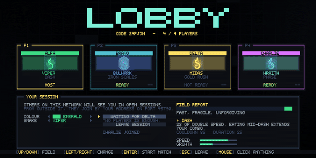
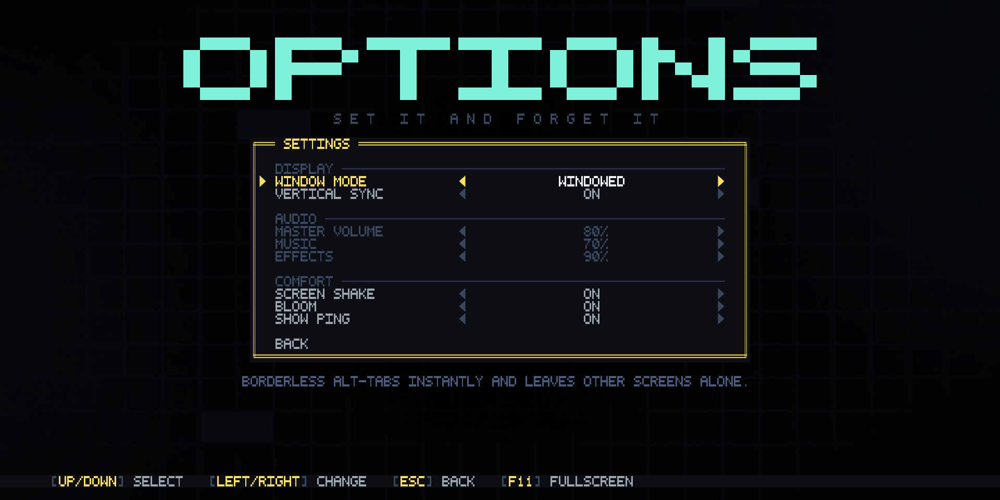
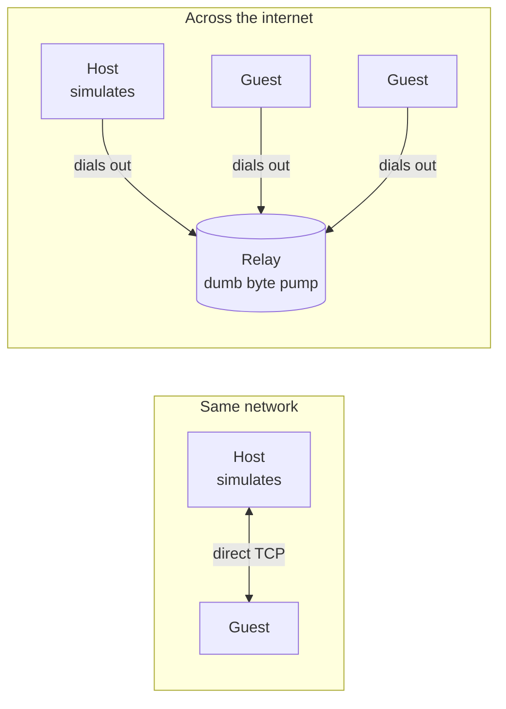
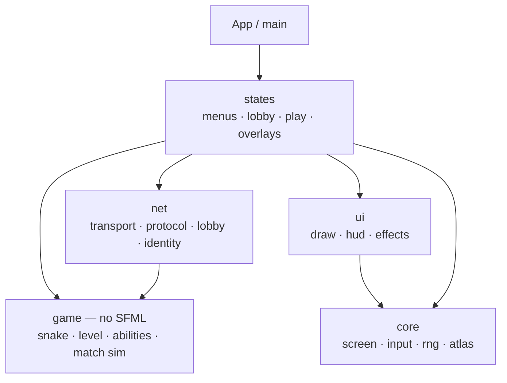

# NEON COIL

An arcade snake game in C++20 on SFML. Five snakes with real mechanical
identities, procedurally generated levels that are *provably* playable, and
four-player online multiplayer that needs no account and no router configuration.


<sup>Every image and clip on this page is the real build, recorded by the game
itself, offscreen, from a pinned seed. Nothing here was staged.</sup>

---

## What it is

| | |
|---|---|
| **Single player** | Offline. No connection, no account, no launcher. Press START. |
| **Multiplayer** | Up to four snakes in one arena. Lobby, matchmaking, join codes. |
| **Levels** | Generated from a seed, then *validated* — 20,000 boards, zero failures. |
| **Snakes** | Five, each a different way to play rather than a palette swap. |
| **Renderer** | Procedural neon: glow, particles, screen shake, batched into a few draw calls. |
| **Input** | Keyboard and mouse everywhere. |
| **Options** | Window mode, vsync, volumes, screen shake, bloom — saved beside the executable. |

## Screens

**The front end.** A name, a colour, and the roster. Each snake's speed, growth and
ability sit next to its portrait, so the pick is informed rather than blind.


**A run.** Level 8, 405 of the 520 points needed to clear it, on a ×3 combo, four
sentinels on patrol and a bonus fruit burning down its timer.


**Four players, one arena.** Eat to score, cut somebody off to score more, respawn a
few seconds later. Highest score when the clock runs out.


**The lobby.** Four players, four snakes, four colours — each seat showing the snake
that player actually picked, with its ability under the portrait, so nobody has to
guess what the table is bringing. The activity feed is real. The host's button names
whoever it is waiting on, because a lobby never has to fill up — two players is a match.




**Options.** Window mode, vertical sync, volumes and comfort toggles, written to a
plain text file beside the executable. `F11` toggles fullscreen from anywhere.



<details>
<summary>More screens — pause, level clear, game over, the session browser</summary>


</details>

## Build

> Open the **folder**, not a solution. This project is CMake-only.

Needs a C++20 compiler and **CMake 3.28+** (SFML 3.1 requires it; Debian 12's 3.25 is
too old). SFML and its dependencies are fetched and built from pinned source on first
configure — nothing to install.

```powershell
cmake --preset release ; cmake --build build-release
```

Two executables come out: `NeonCoil`, the game, and `neoncoil-relay`, the small server
that lets players host over the internet without touching a router.

## Play

`W A S D` or arrows to move. `Space` fires your ability. `P` or `Esc` pauses.
`Enter` confirms. Or click anything — every menu, lobby and overlay is fully
clickable, and hover follows the pointer.

Two turns can be buffered, so fast double-taps around a corner register instead of
being swallowed.

`F11` toggles fullscreen anywhere. Three window modes are offered rather than two:
**windowed**, **borderless** (desktop-sized, no decoration — alt-tabs instantly and
leaves a second monitor alone) and **exclusive fullscreen**. Exclusive fullscreen takes
the display away from the desktop compositor, and the compositor is what draws the
mouse pointer — so in that mode the game draws its own, on the canvas, letterboxed with
everything else. The pointer never disappears, whichever mode you play in.

## Multiplayer

```
Main menu ──> START GAME ────────────────────> run          (offline, no account)
          └─> MULTIPLAYER ──> lobby ──> match ──> results ──> lobby
```

**One player hosts and simulates. Everyone else sends intents and draws what comes
back.** A listen server, not a dedicated one — with four players a datacentre would
make average latency *worse* while adding a bill for authority nothing yet needs.



**The local snake is predicted; nothing else is.** A guest applies its own turn on the
next frame and replays any turns the host has not acknowledged yet, so the controls
answer immediately instead of after a round trip. Reconciliation snaps only when the
host's head is somewhere the prediction never was — being a step ahead is the point,
not a disagreement. Eating, kills and deaths stay host-authoritative, because showing a
score that was not earned and then taking it back is worse than a tenth of a second of
delay. Every snake also slides between tiles rather than jumping, single player
included: it steps seven times a second, and no amount of netcode makes a teleport look
continuous.

Neither end has to accept an inbound connection: **both dial out to the relay**, so
nobody forwards a port. The relay never parses a game message and holds no game
state, so it needs no redeploy when the game changes.

Hosting a session is one button. Joining is a six-letter code, a session picked off
the local network, or an address.

<details>
<summary>Running your own relay</summary>

```bash
cmake -S . -B build -DCMAKE_BUILD_TYPE=Release -DNEONCOIL_RELAY_ONLY=ON
cmake --build build
./build/bin/neoncoil-relay --port 45700
```

`NEONCOIL_RELAY_ONLY` strips graphics entirely, so a headless box needs a compiler and
CMake and nothing else. A `Dockerfile.relay` is included. Then point the game at it
once, in the `netconfig.txt` beside the executable:

```
relay_host = relay.yourdomain.com
relay_port = 45700
```

Players never see any of that. Measured cost: ~150 bytes a snapshot, ~9 KB/s of
egress per match, roughly 100 MB per match-hour.

</details>

**No login, deliberately** — but there is a shaped hole where one goes. Everything
keys off an opaque identity string that nothing outside one header may interpret.
Adding accounts is one new provider and one line at startup.

Full write-up, including why not UDP and why the map is not sent as a seed:
**[docs/MULTIPLAYER.md](docs/MULTIPLAYER.md)**.

## The roster

| Snake | Speed | Growth | Ability |
|---|---|---|---|
| **Viper** | ×1.25 | +1 | **Dash** — 2s of double speed |
| **Bulwark** | ×0.85 | +1 | **Iron Scales** — absorbs a lethal hit, shatters the wall |
| **Wraith** | ×1.00 | +1 | **Phase** — 2.5s through walls and yourself |
| **Midas** | ×1.00 | **+2** | **Gold Rush** — 5s of ×3 food; each bite drops a bonus fruit |
| **Ouroboros** | ×1.10 | +1 | **Shed** — drop half your tail, banking 5 points a segment |

Adding a snake means adding a row to a table, not a subclass.

## Architecture

Five layers, each knowing only the one below it.



`game` never includes an SFML header, which is what lets `--selftest` validate 20,000
levels with no window and no renderer, and what would let the match simulation be
lifted into a dedicated server later. `net` depends on `game` and never the reverse:
the simulation does not know it is being played over a network.

Details — the state stack, the renderer, level generation, progression:
**[docs/ARCHITECTURE.md](docs/ARCHITECTURE.md)**.

## Testing

```bash
./NeonCoil --selftest 20000   # generate and validate 20,000 levels
./NeonCoil --nettest          # host + 3 guests over real sockets, 62 checks
./NeonCoil --uidump lobby     # render any screen offscreen as ASCII
```

`--nettest` runs a full session in one process over loopback: filling the lobby,
refusing a fifth player, playing a match out, a player leaving mid-match, the host
quitting, LAN discovery, and all of it again through the relay. It measures snapshot
size rather than estimating hosting cost.

The screenshots are captured the same way — `--screenshot lobby` stands a real
four-seat session up inside the process. The only thing staged is that all four
players happen to be on one machine.

<details>
<summary>All command-line options</summary>

| Flag | Effect |
|---|---|
| `--seed <n>` | Pin the run seed; every level is reproducible from it |
| `--name <text>` · `--snake <1-5>` | Pre-fill the player name / snake |
| `--selftest <n>` | Generate and validate `n` levels, print a report, exit |
| `--dump <n>` | Print level `n` as ASCII and exit |
| `--uidump <screen>` | Render `menu`/`play`/`pause`/`clear`/`over`/`netmenu`/`lobby`/`netplay` as ASCII |
| `--screenshot <screen> <file.png>` | Render a screen offscreen to a PNG |
| `--capture <screen> <dir>` | Write a numbered PNG sequence for an animation |
| `--frames` · `--every` · `--skip` | Frames to simulate / save one in n / skip before saving |
| `--demo` | Let the autopilot play while capturing |
| `--nettest` | Run the networking self-test and exit |
| `--netconfig <file>` · `--port <n>` · `--discovery-port <n>` | Networking overrides |
| `--help` | Usage |

Every multiplayer flag is optional: with none set, hosting and joining on a local
network need no configuration at all.

</details>

## License

See [LICENSE.txt](LICENSE.txt).
