# NEON COIL

An arcade snake game in C++20 on SFML: five playable snakes with distinct abilities,
procedurally generated levels that are *provably* playable, level-by-level score
progression, and a proper front end.

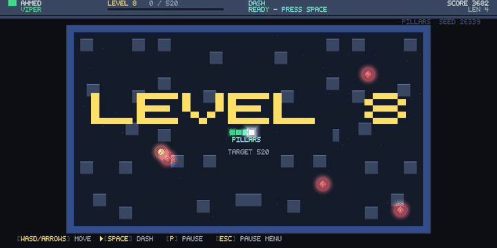

<sup>Every screenshot and clip on this page is the real build. None of it was staged:
the game renders and records itself, offscreen, from a pinned seed — see
[Capturing media](#capturing-media).</sup>

---

## Highlights

- **Five snake types**, each with a real mechanical identity and an active ability —
  not a palette swap.
- **Procedural levels** built from seven layout archetypes, mirrored for readability,
  and validated so unreachable pockets and spawn traps cannot occur.
- **Deterministic seeds.** A run seed is shown on the HUD and can be pinned from the
  command line, so any level you hit can be regenerated exactly.
- **Level progression** with per-level score targets, clear bonuses, and difficulty
  that comes from layout and hazards rather than raw speed.
- **Fully procedural visuals** — additive neon glow, particles, floating score text and
  screen shake, drawn from an atlas the game rasterises at start-up rather than from a
  sprite sheet or a font file. See "Art, and what stays procedural" below.
- **Offline first, online optional.** Single player needs no connection and no
  account. Multiplayer puts up to four snakes in one arena, with a lobby, LAN
  discovery and quick match, hosted by a player rather than by a server anyone has to
  pay for. See [Multiplayer](#multiplayer).

## Screens

**The front end.** A name, one of eight colours, and the roster. Each snake's speed,
growth and ability sit next to its portrait, so the pick is informed rather than blind.

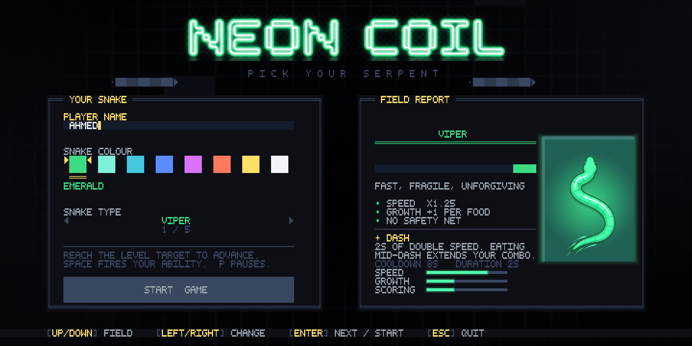

**A run.** Level 8 on a `Pillars` layout, 405 of the 520 points needed to clear it, on a
×3 combo. Four sentinels are on patrol, a bonus fruit is burning down its timer in the
bottom-right corner, and Dash is a third of the way back off cooldown. The HUD carries
the target, the ability state and the seed the board was generated from.

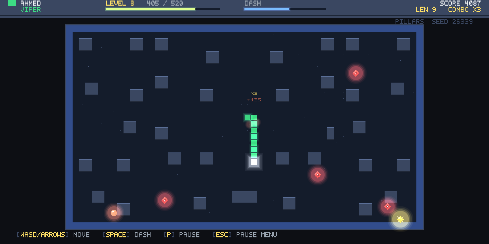

**Pause and level clear.** Both are overlays rather than screens. The world below them
is suspended, not torn down: the board keeps rendering, the HUD keeps its score and
combo, and the level-clear panel still has the snake and the flash from the last fruit
around its edges.

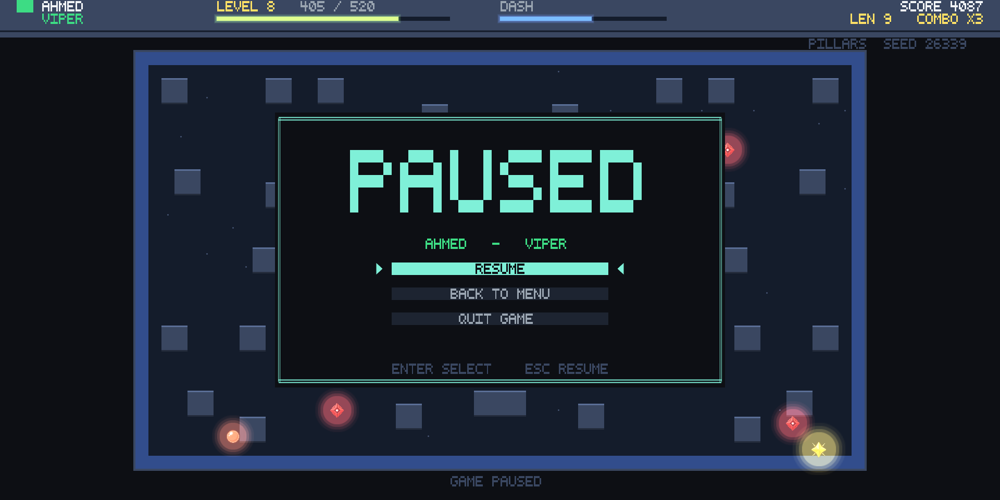

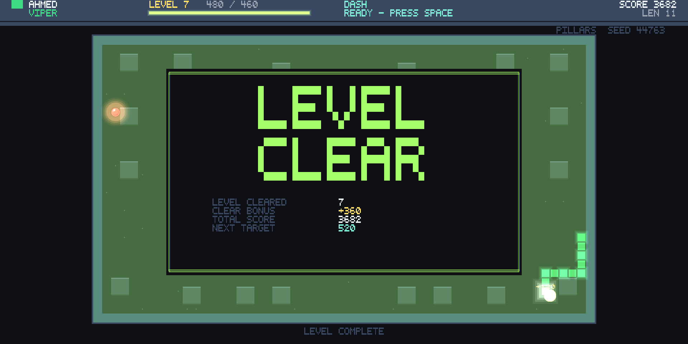

**Game over.** The same run ended on level 16 with 15,396 points, caught by a sentinel.
The seed is on the panel, so that exact run replays with `--seed 424242`.

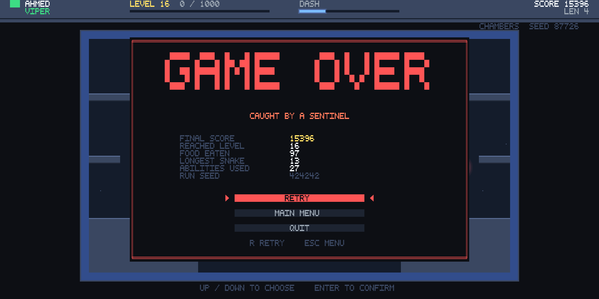

**The lobby.** Four players, four different snakes, four different colours. The join
code is at the top; the activity feed on the right is the real one, listing the three
guests as they arrived. The host's button names whoever it is still waiting on —
DELTA here — because "waiting" on its own reads as "waiting for the lobby to fill",
and it never has to.

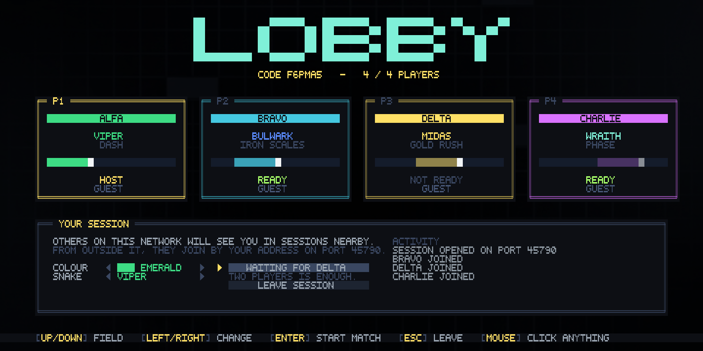

**An online match.** Four snakes on one generated arena. The scoreboard carries each
player's score, kills and deaths and their ability charge; the local player's name is
tagged in their own colour. This is a real session: one host and three guests over
loopback sockets, the same handshake and the same authoritative simulation two people
on opposite sides of the world would be using.

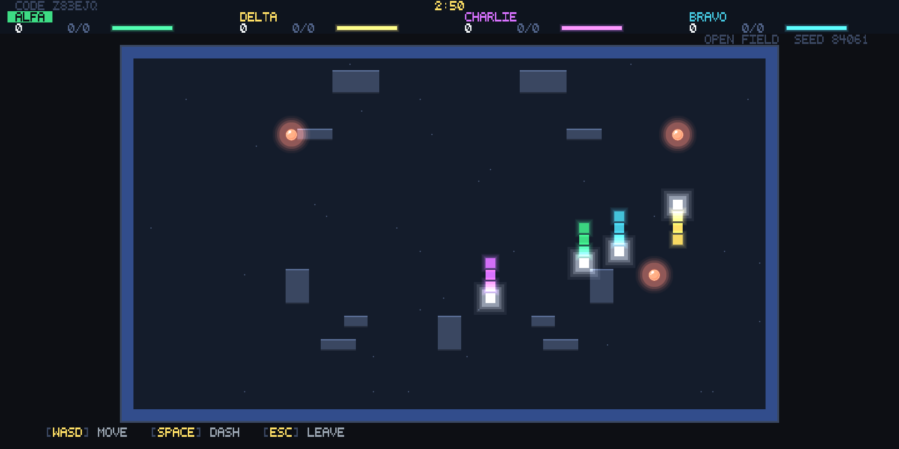

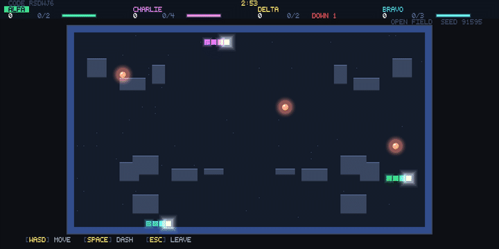

<sup>A real four-player match, recorded by the build. One host and three guests over
loopback sockets, steered by code rather than by hands — everything else, including
the deaths and the respawn timers on the scoreboard, is the game.</sup>

**Finding a game.** Host online, host on your own network, quick match, or type a code
a friend read out to you.

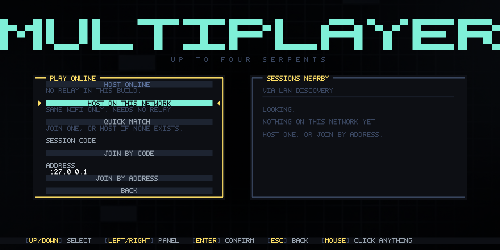

## Build

> **Open the folder, not a solution.** This project is CMake-only. There is no `.sln`
> or `.vcxproj`; if Visual Studio ever recreates one from its cache, delete it along
> with the `.vs` folder and reopen the folder.

Requires Visual Studio 2022 or later with the C++ desktop workload. CMake and Ninja
ship with it. SFML 3.1.0 is fetched and built automatically on first configure, so the
first build takes a few minutes and every one after that is incremental.

> **CMake 3.28 or newer is required.** This project's own floor is lower, but SFML
> 3.1.0 sets `cmake_minimum_required(3.28)`, and a configure on an older CMake fails
> inside the fetched dependency with `CMake 3.28 or higher is required`. Visual
> Studio 2022 is well past it; several Linux distributions are not — Debian 12 ships
> 3.25, so a relay build there needs a newer CMake first. See
> [Running the relay](#running-the-relay).

**Visual Studio:** `File → Open → Folder…` → the repo root → pick the `debug` or
`release` configuration from the toolbar → F5.

**Command line** (PowerShell — note `;`, not `&&`, on Windows PowerShell 5.1):

```powershell
cmake --preset release ; cmake --build build-release
```

The configuration builds two executables: `NeonCoil`, the game, and
`neoncoil-relay`, the small server that lets players host over the internet
without touching a router. The relay links only SFML Network and System — no
window, no GPU, no audio — so it also builds and runs on a bare Linux box. You
only need it if you want online play; see [Running the relay](#running-the-relay).

## Play

```powershell
.\build\bin\NeonCoil.exe
```

Enter a name, pick a colour and a snake, and start. No arguments are required.

### Controls

| Key | Action |
|---|---|
| `W` `A` `S` `D` or arrow keys | Move |
| `Space` | Fire your ability |
| `P` or `Esc` | Pause |
| `Enter` | Confirm |
| `R` | Retry from the game-over screen |
| Mouse | Click any control on any menu; hover highlights it |

Two turns can be buffered, so fast double-taps around a corner register instead of
being swallowed.

Every menu, lobby and overlay is fully clickable — buttons, the colour swatches, the
snake arrows, the address box, and the list of sessions on your network. Pointer
positions are mapped through the same letterbox the game renders into, so clicks stay
accurate at any window size, on any monitor, and in fullscreen. Hover only moves the
highlight while the mouse is actually moving, so a resting pointer never fights the
keyboard for which field is selected.

### Command line

| Flag | Effect |
|---|---|
| `--seed <n>` | Pin the run seed so every level is reproducible |
| `--name <text>` | Pre-fill the player name |
| `--snake <1-5>` | Pre-select a snake type |
| `--selftest <n>` | Generate and validate `n` levels, print a report, exit |
| `--dump <n>` | Print level `n` as ASCII and exit |
| `--uidump <screen>` | Render `menu`/`play`/`pause`/`clear`/`over`/`netmenu`/`lobby`/`netplay` offscreen as ASCII |
| `--screenshot <screen> <file.png>` | Render a screen offscreen and write it to a PNG |
| `--capture <screen> <dir>` | Write a numbered PNG sequence, for assembling into an animation |
| `--frames <n>` | Frames to simulate before a dump or screenshot (default 200) |
| `--every <n>` | Save one frame in `n` while capturing (default 2) |
| `--skip <n>` | Simulate `n` frames before the first one is saved |
| `--demo` | Let the autopilot play while capturing |
| `--nettest` | Run host + clients over loopback and over a relay, play matches out, report, exit |
| `--netconfig <file>` | Read networking settings from `<file>` (default `netconfig.txt`) |
| `--port <n>` | Port to host on, overriding the config file |
| `--discovery-port <n>` | Port used to find sessions on the local network |
| `--help` | Usage |

Every multiplayer flag is optional: with none of them set the game reads
`netconfig.txt` if it is there and otherwise uses built-in defaults, so hosting and
joining on a local network need no configuration at all.

These development tools ship in the build on purpose: they are how the level generator
and the screens are verified, with no GPU window and no human in the loop. `--frames`
drives them far enough to reach a real game state.

### Capturing media

Everything on this page came out of the build itself. An unattended `PlayState` only
slides into the nearest wall, so `--demo` puts an autopilot on the controls — a
breadth-first search to the closest food, refusing any turn into a pocket it could not
get back out of. It presses the same arrow and space keys a player would, through the
same `Input`, so a capture exercises the shipped input path rather than a side door.

The screenshots on this page:

```powershell
.\build\bin\NeonCoil.exe --seed 424242 --name AHMED --screenshot menu  docs\shot_menu.png  --frames 260
.\build\bin\NeonCoil.exe --seed 424242 --name AHMED --demo --screenshot play  docs\shot_clear.png --frames 7600
.\build\bin\NeonCoil.exe --seed 424242 --name AHMED --demo --screenshot play  docs\shot_play.png  --frames 8100
.\build\bin\NeonCoil.exe --seed 424242 --name AHMED --demo --screenshot pause docs\shot_pause.png --frames 9000
.\build\bin\NeonCoil.exe --seed 424242 --name AHMED --demo --screenshot play  docs\shot_over.png  --frames 20000
```

Three of those name the `play` screen and are not mock-ups of a level-clear or a
game-over panel. They are one run at 7,600, 8,100 and 20,000 frames — where the
autopilot happened to be clearing level 7, working level 8, and being caught by a
sentinel on level 16. The pause shot is the same run too: `--demo` reaches that screen
by playing and then pressing `P`, because a `PlayState` paused at frame zero freezes on
the level-one intro and never shows a board worth looking at.

The clips are a PNG sequence assembled by a small Pillow script. `--skip` starts the
capture deep into a run so it opens on a real board rather than on level 1:

```powershell
.\build\bin\NeonCoil.exe --seed 424242 --name AHMED --demo --capture play out\frames --frames 8180 --skip 7700 --every 4
python tools\make_gif.py out\frames docs\demo_play.gif --width 720 --fps 15
```

Because every capture runs from a pinned seed at a fixed 1/60s timestep with no window
and no wall clock in the loop, re-running these commands reproduces the same images.

## The roster

| Snake | Speed | Growth | Ability | Plays like |
|---|---|---|---|---|
| **Viper** | ×1.25 | +1 | **Dash** — 2s of double speed (CD 8s) | Aggressive routing with no safety net |
| **Bulwark** | ×0.85 | +1 | **Iron Scales** — absorbs the next lethal hit and shatters the wall (CD 15s) | Forgiving; turns mistakes into open space |
| **Wraith** | ×1.00 | +1 | **Phase** — 2.5s through walls and your own body (CD 12s) | Shortcuts through mazes |
| **Midas** | ×1.00 | **+2** | **Gold Rush** — 5s of ×3 food, each bite drops a bonus fruit (CD 18s) | Ends levels fast before length becomes a problem |
| **Ouroboros** | ×1.10 | +1 | **Shed** — drop half your tail, banking 5 points a segment (CD 10s) | Grow big, then cash out |

Midas finishing level 7 on 1,055 points against a 460 target, then starting level 8.
Two segments a bite and triple food value under Gold Rush means the level ends on
scoring rate long before length becomes the problem:

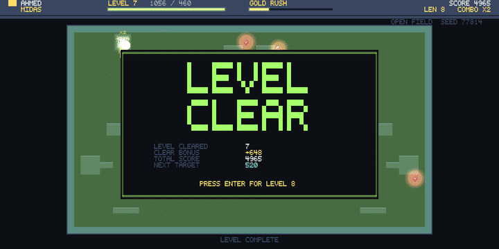

Balance notes worth knowing:

- **Nothing** passes through the arena border — not Phase, not Iron Scales.
- If Phase expires while your head is inside a wall, you die. That is what stops it
  from being a free pass through every level.
- Sentinels are lethal even while phasing. Iron Scales does stop them.
- Shed is refused (rather than wasted) on a snake shorter than seven segments.

## Level generation

Every level is generated from `hash(runSeed, levelIndex)`, so it is fully reproducible.

1. An **archetype** is drawn from a depth-gated pool: `Open Field` and `Pillars` from
   level 1, `Chambers` and `Rings` from 3, `Shards` from 5, `Corridors` and `Cavern`
   from 7.
2. Obstacle density scales from 2% to 16%; sentinels appear from level 5 (up to four);
   tick speed rises by at most 35% across the whole run.
3. The layout is **mirrored horizontally**, which is what makes it read as designed
   rather than as noise.
4. A **spawn pocket** is carved clear.
5. **Dead-end removal** knocks open any tile with only one exit — in a game where you
   cannot stop moving, a one-tile dead end is an instant-death trap.
6. A flood fill from spawn walls off **every region it cannot reach**. Unreachable open
   tiles therefore do not exist, so food can never spawn somewhere you cannot go.
7. If the surviving area is under 45% of the interior, the level is regenerated at a
   lower density. Six attempts, then a guaranteed-valid open room — generation cannot
   fail.

Food spawning is the one operation that can genuinely run out of room. It reports
failure instead of looping, and a board with no free tile counts as a completed level.

### Verifying it

```powershell
.\build\bin\NeonCoil.exe --selftest 20000
```

This sweeps 40 level indices and both start lengths, asserting on every run that the
border is sealed, the spawn and the body tiles behind it are clear, there is room to
move on spawn, no sentinel starts in the spawn pocket, the open-tile cache is current,
every open tile is reachable, and the playable area clears the minimum. The current
build passes 20,000 iterations with zero failures.

## Progression

| | Formula |
|---|---|
| Level target | `100 + 60 × (n − 1)` |
| Food value | `10 + 5 × (n − 1)` |
| Clear bonus | `50 × n + overshoot / 2` |
| Tick | `0.15s ÷ min(1.35, 1 + 0.03 × (n − 1))` |

Food value is tied to the target on purpose: it holds every level at roughly ten to
twelve pickups indefinitely, instead of quietly becoming a grind by level 20. Bonus
fruit (×3) and the combo multiplier (up to ×5 for eating in quick succession) reward
efficiency on top of that.

The snake resets to its starting length at each new level, so difficulty comes from the
board rather than from an unmanageable tail.

## Multiplayer

Single player is the default and needs nothing: no connection, no account, no
session. `START GAME` on the menu goes straight into a run, exactly as it always
has. Everything below is the other button.

`MULTIPLAYER` opens a session browser; from there you host, quick-match, or type
an address. Up to four snakes then share one generated arena for a timed
deathmatch — eat to score, cut somebody off to score more, respawn a few seconds
after you die, highest score when the clock runs out.

**The lobby never has to fill up.** Two players is a match, and the host can start
with any number of seats taken. The only thing that holds a start up is a guest who
has joined and not yet pressed READY UP — and the host's button names them, so
"waiting" never has to be read as "waiting for four".

```
Main menu ──> START GAME ────────────────────> run                (offline)
          └─> MULTIPLAYER ──> lobby ──> match ──> results ──> lobby
```

### The topology, and why there are no dedicated servers

**One player hosts. The host simulates. Everybody else sends intents and draws
what comes back.** A listen server, not a dedicated one.

This is a deliberate decision, not a default:

- **Dedicated servers would make latency worse, not better.** With four players,
  a listen server costs three of them one round trip and the host none. A
  datacentre costs all four a round trip. Unless players are spread across
  continents, the average goes up.
- **They cost money per concurrent match, forever.** The host topology costs
  nothing at ten players and nothing at a hundred thousand, because every match
  runs on somebody's PC. A VPS is cheap but not free, and it comes with a Linux
  build, a container, a deploy pipeline, monitoring and region selection.
- **The thing dedicated servers actually buy is authority against cheating.**
  There is no ladder, no economy and no persistent progression here, so there is
  nothing yet worth cheating for. Revisit this when there is.

What *is* worth having from a dedicated server — one authoritative copy of the
rules — is already here. `MatchSimulation` is the only place the rules exist, it
runs on the host, and the host draws its own board from the same snapshot it
sends everyone else. A guest cannot desync, because a guest never simulates.

The one genuine gap in this topology is **NAT traversal**: two players behind
routers cannot accept each other's connections. That is solved here by a relay
this repository ships and you run — see [Hosting a session](#hosting-a-session).
Both ends dial *out* to it, so no player forwards a port, and it lands exactly
where the design left room for it: a `ServerTransport` / `ClientTransport` pair,
with the session layer, the protocol, the lobby and the simulation untouched.

### Transport

TCP, over SFML's own network module, so multiplayer adds no third-party
dependency — it is a CMake flag on a library the game already links.

TCP for a real-time game is a choice worth defending. The session is four
players, a twenty-hertz snapshot rate and roughly a kilobyte per snapshot, and
every message the protocol defines is one the receiver genuinely must not miss:
lobby state, match start, the final standings. Hand-rolling reliability and
ordering on UDP would buy back one round trip on a dropped packet and cost
several hundred lines that can be got subtly wrong. The game steps eight times a
second; that round trip is not visible.

`ServerTransport` and `ClientTransport` are abstract for exactly this reason — a
UDP, relay or Steam backend slots in underneath without the session layer
noticing.

Networking runs on the game thread, inside `update()`. Sockets are non-blocking
and polled once a frame, which removes every locking question in exchange for at
most one frame of latency. The single exception is the client's connect, which
resolves and handshakes on a worker thread so the menu does not freeze for the
length of a TCP timeout.

### What goes over the wire

The **arena is sent as a packed bitset**, not as a seed. The generator is
deterministic, but it draws from `std::uniform_int_distribution`, whose sequence
is *not* specified across standard library implementations — a Linux client would
generate a different board from a Windows host. A 56×32 board is 224 bytes.
Sending it removes the whole class of problem for the price of one small message,
and it is checked tile-for-tile by `--nettest`.

**Snapshots are absolute, never deltas.** Whole snake bodies, whole food list,
capped at 64 segments per snake so the worst case stays bounded. A client that
misses anything still converges on the next snapshot.

**There is no client-side prediction.** A guest's snake turns when the host says
it turns. On a grid game stepping eight times a second that costs well under one
step of felt latency, and it saves a reconciliation system that would have to be
kept bug-for-bug identical with the host's rules. `InputCommand` already carries a
sequence number, so prediction can be added later without a protocol break.

Every length read off the wire is bounded before anything is allocated, and a
client that has not completed the handshake cannot touch the lobby or the
simulation.

### Matchmaking

`IMatchmaker` is an interface with one implementation today: **LAN discovery**,
which needs no server and no account, so it works the moment the game is
installed.

Clients probe and hosts answer, rather than hosts beaconing. Only the host binds
the fixed discovery port, so any number of clients can browse on the same machine
as a host — which is what makes it possible to test a full four-player session
with four processes on one PC.

`QUICK MATCH` searches for a couple of seconds, joins the **fullest session that
still has room**, and hosts one if there is nothing. Filling one lobby beats
scattering four players across three sessions that never start.

A directory service, a Steam lobby search or a ranked queue all fit behind the
same interface.

### Player identity, and the space left for accounts

**There is no login, and none is implemented.** There is, deliberately, a shaped
hole where one goes.

Everything keys off `net::PlayerIdentity`, whose `id` is an **opaque string that
nothing outside `net/Identity.h` is allowed to interpret**. Today
`LocalIdentityProvider` generates a GUID on first run and keeps it in a file next
to the executable, so a player has a stable identity across runs without ever
having made an account. A joining client presents a `JoinTicket`; the host calls
`IIdentityProvider::verify` and nothing else ever inspects it.

Adding accounts is therefore: write a provider whose `verify` checks a signed
token, and install it instead — one line, in `App::run`. The lobby, the protocol,
the matchmaker and the simulation do not change, because none of them knows what
an id is. `PlayerIdentity::authenticated` already travels in the lobby and is
already rendered on each player card as `GUEST`; the seat-uniqueness rule already
keys off it. `--nettest` proves the seam by running the entire session layer
against a provider it has never seen.

### Configuration

Nothing in `net/` reads a literal port, timeout or match rule. They all come from
`NetConfig`, resolved once at startup: built-in defaults, then `netconfig.txt`
next to the executable if it exists, then the command line. See
[`netconfig.example.txt`](netconfig.example.txt) — every key is optional, and
multiplayer works on a local network with the file absent.

Match rules are host-authoritative and travel to guests inside `MatchStart`, so a
host can retune a match without guests having the same config file.

### Joining, leaving and things going wrong

- **A player leaving mid-match** takes their snake with them and the match
  carries on. No pause, no vote, no stall.
- **A fifth player** is refused with a reason on screen, not dropped silently. So
  is somebody trying to join a match already in progress; the lobby reopens when
  it ends.
- **The host quitting** sends every guest a reason before the socket closes, and
  they land back on the multiplayer menu knowing why.
- **Host migration is not implemented.** With the authoritative state already
  serialisable and the transport already abstract, it is an addition rather than
  a redesign — but it is not there, and a host leaving ends the session.
- **There is no pause.** Pausing a four-player match means pausing everybody,
  which is a host power this mode does not need.

### Testing it

```bash
./NeonCoil --nettest
```

Sixty-two checks, in one process, over real sockets, with no window — and it is
the only way this part of the game can be verified without four people in a room.

The first half runs a host and three clients on loopback: filling the lobby,
refusing a fifth player, refusing a duplicate account, letting two guests share
one local guest id, readying up, starting a match, checking the arena arrived
intact tile-for-tile, steering, a player leaving mid-match, playing the match out,
reading the standings, returning to the lobby, the host quitting, and LAN
discovery finding an advertised session.

The second half stands a relay up inside the test process and does it all again
through it, including a code typed the way a person would type it. Details under
[Hosting a session](#hosting-a-session).

Layouts are checked the same way every other screen is:

```bash
./NeonCoil --uidump netmenu
./NeonCoil --uidump lobby
./NeonCoil --uidump netplay
```

And the multiplayer screenshots on this page are captured the same way the
single-player ones are: by the build, not by hand. `--screenshot lobby` and
`--screenshot netplay` stand a real four-seat session up inside the process — one
host, three guests over loopback, the real handshake, the real authoritative
simulation. The guests are steered by a small look-ahead that prefers open ground
and closes on food, so the board is alive rather than four corpses. The only thing
staged is that all four players happen to be on one machine.

```bash
./NeonCoil --screenshot lobby docs/shot_lobby.png --frames 90
./NeonCoil --screenshot netplay docs/shot_netplay.png --frames 620
./NeonCoil --capture netplay frames --frames 1400 --skip 430 --every 5
python tools/make_gif.py frames docs/demo_netplay.gif --width 720 --fps 14
```

To play it for real on one machine, start two or more copies from the build
output. Give each its own identity file if you want them to look like different
people:

```bash
./NeonCoil --name ALFA
./NeonCoil --name BRAVO --netconfig bravo.txt
```

The first hosts; the rest find it under `SESSIONS NEARBY`, or join `127.0.0.1`.

### Hosting a session

There is no server to run for a normal game and nothing for a player to
configure. A host is a copy of the game with a host button pressed.

**HOST ON THIS NETWORK** opens a TCP listener and answers discovery probes.
Everyone on the same wifi sees the session under `SESSIONS NEARBY` and clicks it.
Nothing to set up, no relay, no account. This is the whole story for a LAN party
or two people in one house.

**HOST ONLINE** does not listen at all. It dials *out* to the relay, which hands
back a six-character code. Guests type the code and dial out to the same relay,
and the relay pumps bytes between them. Neither end ever accepts an inbound
connection, so **nobody forwards a port** — and because it never relies on
punching a hole through a NAT, it works where hole punching does not: behind
carrier-grade NAT, on a phone hotspot, on a locked-down office network.

That is the same shape as Steam Datagram Relay, except you run the relay instead
of Valve, and you do not need a Steam AppID to do it.

### Running the relay

The relay ships in this repository as a second binary, `neoncoil-relay`, built by
the same CMake configuration. Locally it comes out of a normal build:

```bash
cmake --build build --target neoncoil-relay
```

**On a server, build it relay-only.** `-DNEONCOIL_RELAY_ONLY=ON` leaves SFML's
Graphics, Window and Audio modules out entirely, so a bare box needs a compiler
and CMake and nothing else — no X11, no OpenGL, no FreeType, no ALSA.

First check the CMake version, because most stable distributions ship one too old
for SFML 3.1 and the failure happens deep inside the fetched dependency rather
than anywhere obvious:

```bash
cmake --version   # needs 3.28+; Debian 12 ships 3.25
```

If it is older, install a current one over the top — no repository to add:

```bash
curl -fsSL https://github.com/Kitware/CMake/releases/download/v3.31.6/cmake-3.31.6-linux-x86_64.tar.gz | sudo tar -xz --strip-components=1 -C /usr/local
```

Then:

```bash
cmake -S . -B build -DCMAKE_BUILD_TYPE=Release -DNEONCOIL_RELAY_ONLY=ON
cmake --build build
./build/bin/neoncoil-relay --port 45700
```

On a 1 GB instance, add swap first and cap the parallelism, or the compile is
killed part-way through with no useful message:

```bash
sudo fallocate -l 2G /swapfile && sudo chmod 600 /swapfile && sudo mkswap /swapfile && sudo swapon /swapfile
cmake --build build -- -j2
```

Or skip installing a toolchain on the server at all:

```bash
docker build -f Dockerfile.relay -t neoncoil-relay .
docker run -d --restart=always -p 45700:45700 --name relay neoncoil-relay
```

Then point the game at it, once, in the `netconfig.txt` that ships beside the
executable:

```
relay_host = relay.yourdomain.com
relay_port = 45700
```

Players never see any of that. They press `HOST ONLINE`, read out a code, and
their friends type it in.

Because the relay never parses a game message, that image and that binary do not
need rebuilding when the game changes.

**What it costs.** `--nettest` measures this rather than guessing at it, and the
number is small: a snapshot of four short snakes is about **150 bytes**, and the
64-segment length cap puts the worst case near **1.2 KB**. At the default 20 Hz
with three guests that is **9 KB/s of egress early in a match and about 70 KB/s
at the absolute ceiling** — call it 30 to 260 MB per match-hour, typically
around 100 MB.

Only the outbound half counts: the host uploads one snapshot and the relay fans
it out, so the host's narrow upstream carries one copy rather than three, and
what the relay receives is ingress, which is free almost everywhere.

At ~100 MB per match-hour, **10 TB of monthly egress is on the order of a hundred
thousand match-hours**. Bandwidth is not what will limit this, and neither is
CPU: forwarding opaque blobs is not work. Halving `snapshot_hz` to 10 halves the
figure again with no visible difference on a game that steps eight times a
second.

**Why it stays cheap.** The relay never parses a game message, never runs the
rules, and holds no game state. It is a rendezvous table and a byte pump. That
means no per-match CPU, no memory that scales with snake length, and — the part
that matters over years — **no redeploy when the game changes**. The game
protocol can be rewritten entirely and the relay does not care.

It also means the relay is not a dedicated server and should not be confused for
one. The host still simulates; authority never leaves the host.

**Where to run it.** The requirements are unusually low: a public IPv4 address, a
few hundred MB of RAM, and the ability to hold a long-lived TCP listener. No
disk, no database, no GPU. That puts it inside several providers' permanently
free tiers — the constraint to check is always **monthly egress**, since at
~100 MB per match-hour even a modest allowance covers far more play than a small
game will generate. An IPv6-only box is the one thing to avoid: plenty of
players are still IPv4-only and would simply be unable to connect.

**Deploying it.** It links only SFML Network and System — no window, no GPU, no
X11, no audio — so a bare Linux box is enough. As a systemd unit:

```ini
[Unit]
Description=NEON COIL relay
After=network.target

[Service]
ExecStart=/opt/neoncoil/neoncoil-relay --port 45700 --quiet
Restart=always
User=neoncoil

[Install]
WantedBy=multi-user.target
```

Open TCP `45700` on the relay machine's firewall. That is the only port
forwarding in the entire system, it is done once, by you, on a machine you
control — and never by a player.

### Which host button to use

| | Reaches | Needs |
|---|---|---|
| `HOST ON THIS NETWORK` | Same wifi / LAN | Nothing |
| `HOST ONLINE` | Anywhere | A relay you run, configured once in `netconfig.txt` |
| `JOIN BY ADDRESS` | A host that is listening | The host's address, and a forwarded port if across the internet |

`JOIN BY ADDRESS` is kept for direct connections — LAN debugging, a dedicated box
on a network you control — but it is no longer the answer for internet play, and
no player has to reach for it.

### Testing it

```bash
./NeonCoil --nettest
```

Sixty-two checks. The second half stands a relay up inside the test process and
plays a whole match through it: registering, handing out a code, two guests
joining by code (one of them typed in lowercase with a dash in it, the way a
person would), refusing an unknown code, the arena crossing the relay intact
tile-for-tile, snapshots, a guest leaving mid-match, the standings, and the host
quitting.

To try it by hand on one machine, in three terminals:

```bash
./neoncoil-relay --port 45700
```

Then create a `netconfig.txt` next to `NeonCoil` containing
`relay_host = 127.0.0.1`, and start two copies of the game. One presses
`HOST ONLINE` and reads the code off the lobby; the other types it into
`SESSION CODE` and presses `JOIN BY CODE`.
### Where this goes next

The architecture was shaped so that each of these is an addition rather than a
rewrite:

| Want | Costs |
|---|---|
| Accounts / login | A new `IIdentityProvider`. One line in `App::run`. |
| Friends, invites, presence | A new `IMatchmaker`; join codes already exist. |
| Steam, if you ever want it | A `ServerTransport` / `ClientTransport` pair over `ISteamNetworkingSockets` — the same shape as the relay pair that already exists. Not required: the relay already solves NAT traversal without it. |
| Persistent stats and progression | Keyed off `PlayerIdentity::id`, already carried through the lobby and the standings. |
| Dedicated servers | `MatchSimulation` is already headless and rules-complete. A server binary is a `main()` and a transport, not a port. |
| Client-side prediction | `InputCommand` already carries a sequence number. |

## Architecture

Five layers, each only knowing about the one below it: `core` (window, input, RNG,
text/shape rasterising), `game` (rules — snake, level, food, abilities, progression,
the match simulation, none of it aware SFML exists), `net` (transport, protocol,
lobby, matchmaking, identity — aware of `game` but never of `states` or `ui`),
`states` (the screens, wiring `game` and `net` to input and to `ui`), `ui` (drawing
helpers built on `core::Screen`). `App` and `main.cpp` sit above all five and only
exist to parse argv and drive the loop, a capture or a self-test.

`net` depends on `game` and not the other way round: `MatchSimulation` does not know
it is being played over a network, which is what lets it be lifted into a dedicated
server binary later, and what lets `--nettest` run a whole session with no renderer.

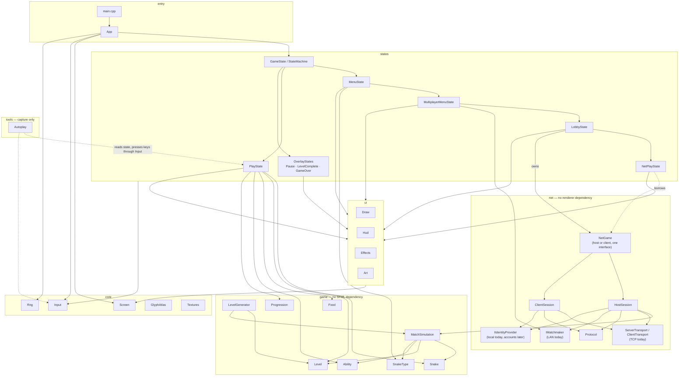

`game` never includes an SFML header — `Snake`, `Level`, `Food`, `Ability` and
`Progression` are plain data and logic, which is what makes `--selftest` able to
generate and validate 20,000 levels with no window, no renderer, and no frame loop.

### The state stack

Screens are a stack, not a single "current screen" variable. `Pause`, `LevelComplete`
and `GameOver` are **overlays**: pushed on top of `PlayState` rather than replacing it,
so the board underneath keeps its snake, its score and its combo — which is why the
pause and level-clear screenshots above still show a live board behind the panel.
`StateMachine::update` only calls `update` on the top of the stack (an overlay
genuinely suspends the world), but `render` walks back to the last non-overlay state
and draws forward, compositing every overlay above it on top.

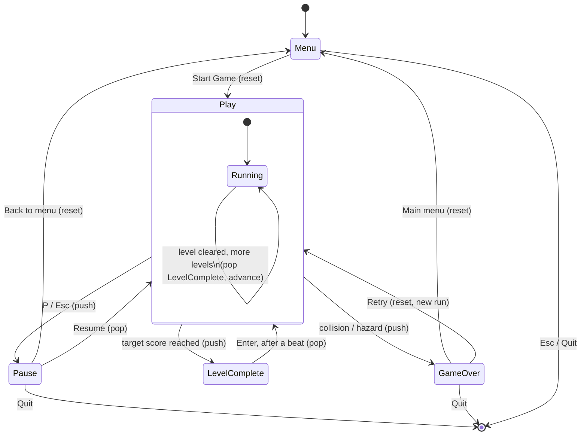

Three design decisions worth calling out beyond the stack itself:

- **Snake types are a data table, not a class hierarchy.** Adding a snake is one row in
  `SnakeType.cpp` plus, if it brings a new ability, one case in `Ability.cpp`.
- **Ability effects live in one file.** Gameplay code never branches on `AbilityKind`;
  it asks `speedScale()`, `canPhaseWalls()`, `scoreMultiplier()` and so on.
- **Levels are generated, then proven, before they're handed to `PlayState`.** See
  "Level generation" above — the generator's invariants are checked by construction,
  not hoped for at runtime.

```
src/
  main.cpp          entry point and mode dispatch
  App.*             CLI parsing, self-test, UI dump, the frame loop
  core/
    Screen.*        window, virtual canvas, letterboxing, the batched draw layers
    GlyphAtlas.*    rasterises text and shape glyphs into one texture at start-up
    BlockFont.*     the 5x5 bitmap font, shared by the atlas and the big captions
    Input.*         edge-triggered actions fed from the window's event queue
    Rng.*           seeded mt19937 with a mixer for reproducible sub-seeds
    Vec2.h  Colors.h  Glyphs.h
  game/
    Snake.*         body, movement, buffered turns, occupancy counts
    SnakeType.*     the roster, as data
    Ability.*       every ability effect, behind queries the game asks
    Level.*         tile grid, hazards, open-tile cache
    LevelGenerator.*  archetypes, validation, seeding
    Food.*          normal and timed bonus food
    Progression.*   targets, food values, difficulty curve
    Direction.h
  states/
    GameState.*     state interface and the state stack
    MenuState.*     name, colour, snake selection with a live preview
    PlayState.*     the run: board, snake, food, scoring, level progression
    OverlayStates.* pause, level complete, game over
  tools/
    Autoplay.*      the --demo autopilot: BFS to the nearest food, refusing any
                    turn into a pocket it cannot escape. Capture tooling only --
                    no gameplay code consults it.
  ui/
    Draw.*  board and meter helpers   Art.*  big block-font captions
    Hud.*   the play HUD              Effects.*  particles, shake, flash
    Layout.h  canvas, cell grid and board pixel constants
```

This tree is the same four layers as the dependency diagram above, just laid out as
paths instead of arrows.

### Rendering

`Screen` owns the window and draws to a fixed **1920×960 virtual canvas** that is
letterboxed into whatever size the window is, so the layout is identical at any
resolution and in fullscreen (`F11`). Everything is batched into a handful of draw
calls across five layers, in order:

| Layer | Blend | Holds |
|---|---|---|
| Pixel | alpha | Board, walls, snake, food, hazards, particles |
| Glow | additive | Neon bloom for all of the above |
| Cell | alpha | HUD, menus, panels, all text |
| Overlay | alpha | Pixel-precise widgets that must sit over a panel — the meters |
| Overlay glow | additive | Their bloom |

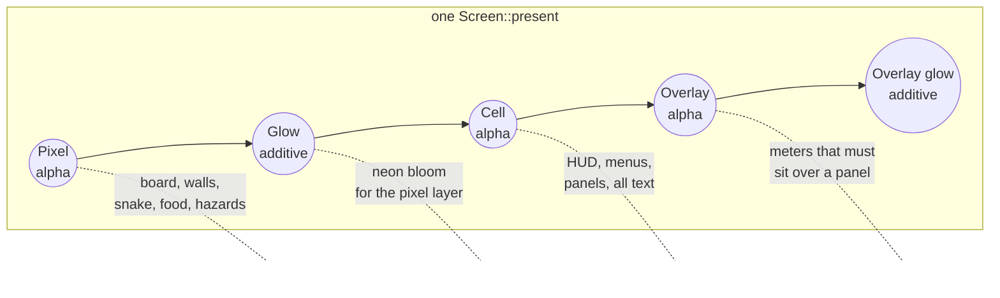

Each layer is one `sf::VertexArray`, filled by every state's `render()` call across the
frame and flushed as a single draw call in `Screen::present` — so five layers means five
draw calls for everything on the atlas: walls, snake, particles, HUD text, panels, all
of it, however many there are. Loaded images (the logo, portraits, board sprites) sit
outside the atlas and each cost their own draw call, inserted before, between or after
the five depending on their `SpriteLayer` (`Background` / `World` / `Ui`).

Two coordinate spaces share that canvas. **Cells** (16×24 px) are the grid the UI and
text are laid out on. The **board** has its own square-tile pixel space (25 px) — cells
are taller than they are wide to suit text, so putting the board on them made every
tile a stretched rectangle. Its own space is also what makes glow and screen shake
possible, since neither has to snap to a grid.

### Art, and what stays procedural

There is **no font file.** `GlyphAtlas` rasterises one texture at start-up: text from
the 5×5 block font in `core/BlockFont.h`, and every block, shade, box-drawing run and
marker from an analytic shape with supersampled coverage. A cell is then a single
tinted quad.

The snake, the walls and the board are procedural for the same reason. The player picks
one of eight colours across five snake types, and the phase, dash and shield states
recolour the snake on top of that — baked sprites would need forty variants and still
could not tint at runtime. Procedural shapes stay crisp at 4K and tint for free.

What *is* an image file is the fixed art: the logo and menu plate, the five roster
portraits, and the food and sentinel sprites, all under `assets/`. Every one of them is
optional. `Textures` returns null for anything missing and each call site falls back to
the procedural glyph it used before, so a build with an empty `assets/` folder still
runs and still looks like the game — it just looks plainer.

`docs/ASSETS.md` has the prompts and the closed palette every asset has to match;
`tools/gen_art.ps1` and `tools/import_incoming.ps1` generate and slice them.
`assets/marketing/` is gitignored, being large and regenerable.

## License

MIT — see `LICENSE.txt`.

Author: Ahmed Afifi.
